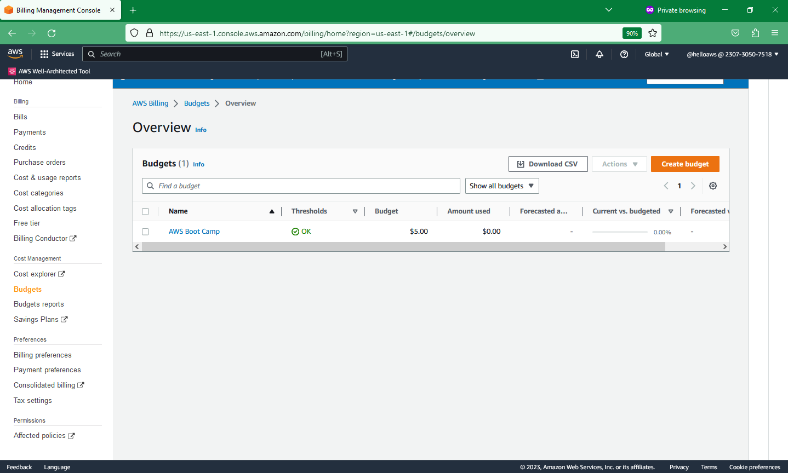

# Week 0 — Billing and Architecture

## HomeWork Required 

Created an new user Admin in AWS .

Installed AWS CLI via GitHub.

Billing enabled.

## Billing Alarm created.

## Aws budget created 

## Done the drawing with LUCID App.
   

   

Nakpin Drawing 
Yet to do

## 
-----------------------------------------------------------------------------------------------------------------------------------------------------------------------

## Homework Challenges 
AWS CLI not working in the portal

For some reasons my AWS CLI in AWS portal gives error and not sure why .

I tried fixing but no success, i so sent an emai to AWS support but they are asking for upgrade. Guess should close and reopen an new account if issues hasn't be recified . Below is the error. Note i switched regions and still same problem.

**Unable to start the environment. To retry, refresh the browser or restart by selecting Actions, Restart AWS CloudShell. System error: Environment was in state: CREATION_FAILED. Expected environment to be in state: RUNNING. To retry, refresh the browser or restart by selecting Actions, Restart AWS CloudShell.**
